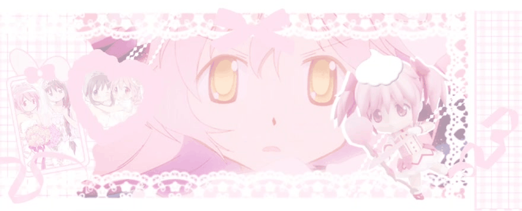

<a id="top"></a>

<div align="center">
  <a href="#about"></a>
  <a href="#building"></a>
  <a href="#skills"></a>
  <a href="#projects"></a>
  <a href="#stats"></a>
  <a href="#anime"></a>
</div>

<div align="center">
  
</div>

<h1 align="center">✦Hello World, It's me Lucas Frischeisen ✦</h1>

<div align="center">
  
</div>

<br>

<a id="about"></a>
## ✦ About Me

> *“I don't just develop software. I create characters, tools, and intelligent ecosystems.”*

I'm an **AI & Backend Engineer** working with agents, RAG, memory, voice, probabilistic system evaluation, and architecture for real-world products. I like building software that doesn't feel like yet another generic dashboard: systems with identity, behavior, and a technical explanation behind what they do.

I also produce electronic music as **Reskyume/Rukafuu**, follow anime and visual novels with a slightly unhealthy devotion, and believe personality is not technical debt.

```ts
const lucas = {
  role: "AI & Backend Engineer",
  focus: [
    "agent systems",
    "context engineering",
    "voice and memory",
    "reliable backend architecture",
  ],
  principle: "evidence before confidence",
  currentlyPlaying: "something magical and loud at 3 AM",
};
```

---

<a id="building"></a>
## ♡ Building & Exploring

<div align="center">

[](https://github.com/Rukafuu/DEUS)
[](https://github.com/Rukafuu/DEUS-Vscode)
[](https://github.com/Rukafuu/TimeWarp)
[](https://github.com/Rukafuu/Ketchup)
[](https://github.com/Rukafuu/GhostCLock)
[](https://github.com/Rukafuu/ExpoMCP)

</div>

<a id="skills"></a>
## ✧ Technologies & Practice

<div align="center">

**AI & Agent Systems**
<br>


<br>

**Backend & Systems**
<br>


<br>

**Frontend & Creative Work**
<br>


</div>

---

<a id="projects"></a>
## ☾ Selected Projects

<div align="center">
  <table>
    <tr>
      <td align="center" valign="top" width="50%">
        <a href="https://github.com/Rukafuu/LiraVtuber"></a>
        <p><strong>LiraVtuber · Voice & memory</strong><br>A Python desktop assistant combining voice, hybrid memory, local tools and Live2D interaction.</p>
        <p><sub>Desktop assistant project</sub></p>
      </td>
      <td align="center" valign="top" width="50%">
        <a href="https://github.com/Rukafuu/AAG-Protocol"></a>
        <p><strong>AAG Protocol · Verifiable agent context</strong><br>A specification for evidence-based repository maps, with reference tooling to evaluate their impact on agents.</p>
        <p><sub>Draft protocol · Experimental benchmark</sub></p>
      </td>
    </tr>
    <tr>
      <td align="center" valign="top">
        <a href="https://github.com/Rukafuu/DEUS"></a>
        <p><strong>DEUS · Language, compiler & VM</strong><br>A specialized language for information retrieval pipelines, implemented in C17 with type checks and runtime resource limits.</p>
        <p><sub>Experimental · <a href="https://github.com/Rukafuu/DEUS-Vscode">VS Code extension & native LSP</a></sub></p>
      </td>
      <td align="center" valign="top">
        <a href="https://github.com/Rukafuu/TimeWarp"></a>
        <p><strong>TimeWarp · Capture, inspect & replay</strong><br>Go tooling for local causal recording and HTTP replay, reproducing captured responses without contacting the original dependency.</p>
        <p><sub>MVP · CLI & local MCP interface</sub></p>
      </td>
    </tr>
    <tr>
      <td align="center" valign="top">
        <a href="https://github.com/Rukafuu/Ketchup"></a>
        <p><strong>Ketchup · Workspace context</strong><br>A Go CLI and editor extension that detect Git, dependency and environment drift and summarize relevant changes since the last session.</p>
        <p><sub>CLI · Published VS Code / Open VSX extension</sub></p>
      </td>
      <td align="center" valign="top">
        <a href="https://github.com/Rukafuu/PortfolioAB"></a>
        <p><strong>PortfolioAB · Code & music</strong><br>A cassette-inspired portfolio built with React, TypeScript and Cloudflare, connecting technical projects, original music and a public Lira experience.</p>
        <p><sub>Interactive portfolio · <a href="https://lucas-personal-os.reskyume.chatgpt.site">Website</a></sub></p>
      </td>
    </tr>
  </table>
</div>

### More tools & past experiments

- **[GhostClock](https://github.com/Rukafuu/GhostCLock)** — Experimental C17/Win32 performance tooling; the current MVP measures a baseline and applies reversible process-priority changes.
- **[ExpoMCP](https://github.com/Rukafuu/ExpoMCP)** — A local MCP server for Expo/React Native project inspection, dependency checks and diagnostics.
- **[LiraOS](https://github.com/Rukafuu/LiraOS)** — An AI companion ecosystem exploring agents, visual perception, voice and conversational memory. **Paused indefinitely; maintenance and public deployment suspended.**

---

<a id="stats"></a>
## ✦ Statistics

<div align="center">
  
  <br><br>
  
  
</div>

---

<a id="anime"></a>
## ♡ Anime & Manga Status

<div align="center">
  <table>
    <tr>
      <td align="center" width="400">
        <strong>📺 Anime Stats</strong><br>
        <code>Days: 123.2</code> | <code>Mean: 7.91</code><br>
        <code>Completed: 472</code> | <code>Episodes: 7,607</code>
      </td>
      <td align="center" width="400">
        <strong>📖 Manga Stats</strong><br>
        <code>Days: 14.8</code> | <code>Mean: 8.21</code><br>
        <code>Completed: 15</code> | <code>Chapters: 1,535</code>
      </td>
    </tr>
  </table>
</div>
<br>

<div align="center">

**Favorite Anime**
<br>


<br>

**Favorite Manga**
<br>


<br>

**Favorite Characters**
<br>


</div>

---

## ✧ Connect With Me

<div align="center">
  <a href="https://www.linkedin.com/in/rukafuu/">
    
  </a>
  <a href="https://discord.com/users/334099538803425280">
    
  </a>
  <a href="https://lucas-personal-os.reskyume.chatgpt.site">
    
  </a>
  <a href="mailto:contato@rukafuu.dev">
    
  </a>
</div>

<br><br>

<div align="right">
  <a href="#top">
    
  </a>
</div>
